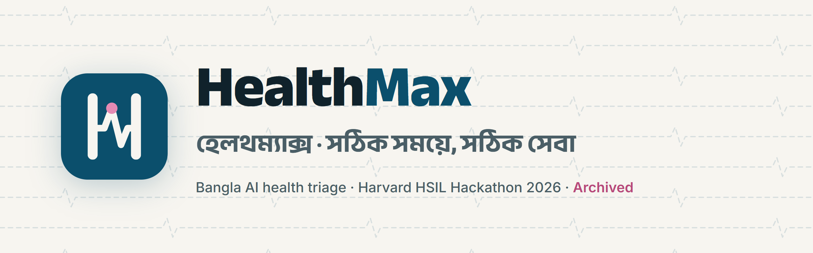
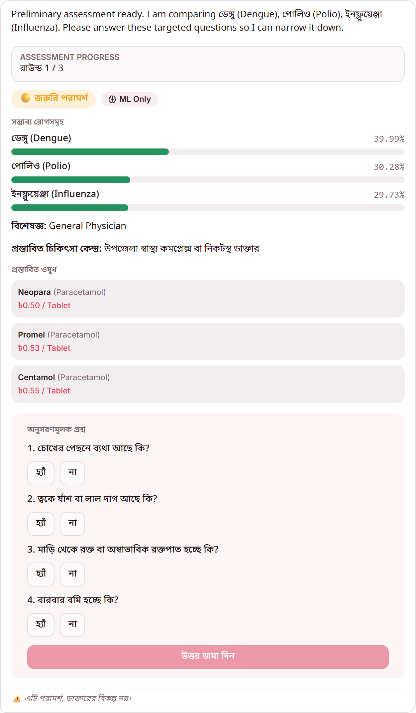
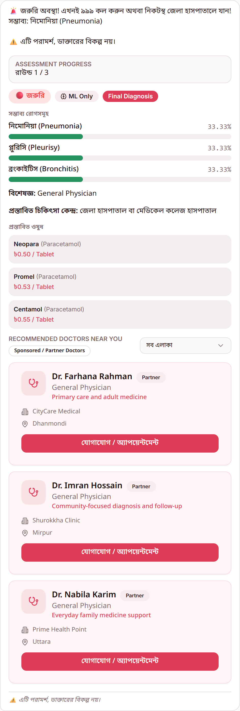
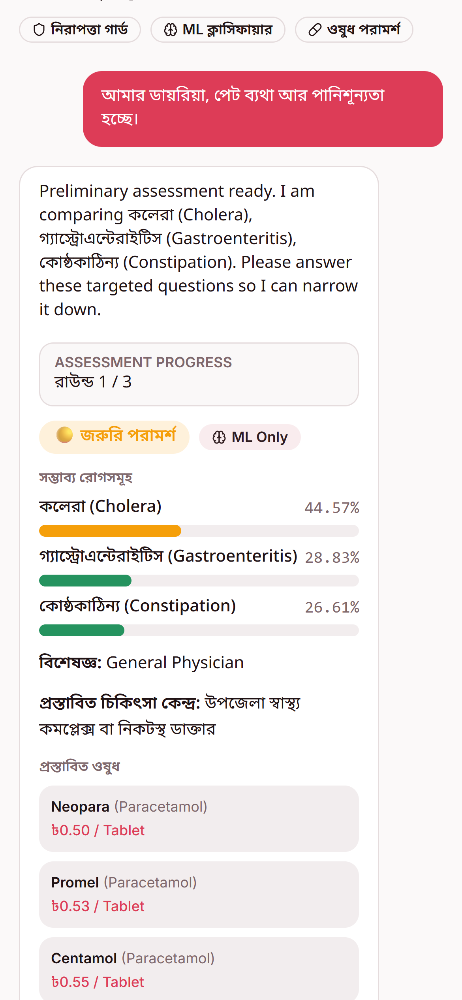
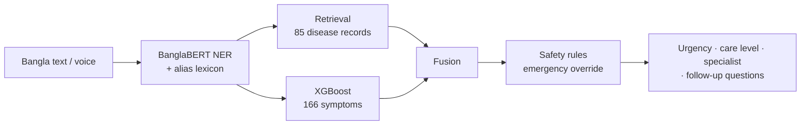
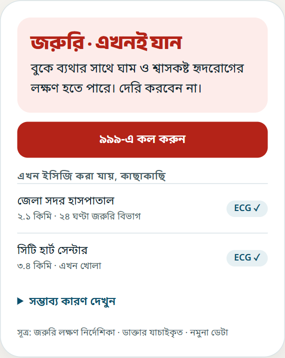

<p align="center">
  
</p>

<p align="center">
  <b>Bangla, voice-first AI health triage for rural Bangladesh.</b><br>
  Built for the Harvard HSIL Hackathon 2026 · <b>Archived October 2026</b>
</p>

> [!WARNING]
> **Research prototype. Not a medical device. Do not use it for real health decisions.**
> On our own 50-case benchmark it caught only 9 of 17 emergencies ([evaluation](docs/EVALUATION.md)). The doctors shown in the app are fictional demo data.

## What it does

A person describes their symptoms in Bangla, by typing or speaking. HealthMax:

1. extracts the symptoms with a fine-tuned **BanglaBERT** medical NER model;
2. ranks likely conditions using **disease retrieval + an XGBoost classifier + safety rules**;
3. asks up to three rounds of **targeted follow-up questions** to narrow it down;
4. returns an **urgency level** (emergency / urgent / self-care), the level of care to go to (community clinic → upazila health complex → district hospital) and a specialist.

The same pipeline runs as a **FastAPI service** (with Whisper-Bangla speech input and a WhatsApp webhook) and **entirely in the browser**, so the hosted demo needs no server.

| Follow-up questions | Emergency override | Mobile |
|---|---|---|
|  |  |  |

<sub>Screenshots of the shipped hackathon build (Bangla UI), captured 2026-10-02.</sub>

## Results (measured, not claimed)

| Component | Metric | Score | Source |
|---|---|---|---|
| Bangla medical NER (BanglaBERT, 3 entity types) | F1 on the silver-label validation set | **0.790** | [`models/ner_training_summary.json`](models/ner_training_summary.json) |
| Disease classifier (XGBoost, 85 diseases) | Macro F1 on held-out rows | **0.726** | [`models/training_summary.json`](models/training_summary.json) |
| Full triage engine | Urgency accuracy on 50 Bangla vignettes | **46%** | [`docs/EVALUATION.md`](docs/EVALUATION.md) |
| Full triage engine | Emergency recall | **53%** | [`tests/results/triage_benchmark.json`](tests/results/triage_benchmark.json) |

The parts score reasonably well, but the whole system does not. Most of the reason is the data: 757 rows of symptom presence, with no severity or duration and no self-care labels. The [post-mortem](docs/POSTMORTEM.md) explains this, along with why we stopped.

## Architecture



Details: [docs/ARCHITECTURE.md](docs/ARCHITECTURE.md) · Models and data: [docs/MODELS_AND_DATA.md](docs/MODELS_AND_DATA.md)

## Tech stack

| Layer | Tools |
|---|---|
| ML / NLP | PyTorch, Hugging Face Transformers (BanglaBERT, Whisper-Bangla), XGBoost, scikit-learn, FAISS / TF-IDF, RapidFuzz |
| Backend | FastAPI, Twilio (WhatsApp / voice), Google Cloud TTS, optional GPT-4o / Bedrock Claude for response text |
| Web app | React 18, TypeScript, Vite, Tailwind, shadcn/ui, Web Speech API (`bn-BD`) |
| Platform | Supabase (Postgres, auth and roles, Edge Functions), Vercel |
| Evaluation | Vitest / vite-node benchmark harness |

## Run it locally

```powershell
# Web app (runs the in-browser engine; no backend needed)
cd healthmax-ai-assistant
npm install
npm run dev            # http://localhost:8080/triage

# Urgency benchmark
npx vite-node ../tests/eval_triage.ts

# Optional: Python service (Python 3.12)
cd ..
py -3.12 -m venv .venv; .\.venv\Scripts\Activate.ps1
pip install -r requirements.txt
python -m uvicorn backend.main:app --port 8000   # POST /api/triage
```

Model training and reproduction steps: [docs/MODELS_AND_DATA.md](docs/MODELS_AND_DATA.md#reproducing).

## Brand kit

After archiving, I designed a v1 brand kit as a design exercise. It addresses a real flaw in the shipped app: its crimson brand colour was nearly identical to its emergency red. The kit includes a mark (an H whose crossbar is a heartbeat, which also reads as *HM*), a WCAG-checked palette with a **reserved urgency scale**, Bangla-first typography, and UX rules for designing for a worried person.

<p align="center"></p>

[brand/README.md](brand/README.md) · [guideline page](brand/guidelines.html)

## What I learned

- **Do the market scan before writing code.** A direct competitor (AmarDoctor, with 1.4M clinic visits behind it) already existed.
- **Triage is about urgency and where to go, not disease ranking.** We optimised the wrong output.
- **Build the benchmark first.** Ours was broken by a CSV quoting bug, so quality went unmeasured until the end.
- **One engine, not two.** The Python and TypeScript pipelines drifted apart.
- **Demo shortcuts become product decisions:** medicine suggestions, "Final Diagnosis" labels, sponsored placeholder doctors.

Full write-up: [docs/POSTMORTEM.md](docs/POSTMORTEM.md)

## Repository

```text
backend/                 FastAPI service: NER, retrieval, classifier, fusion, rules, ASR/TTS, medicine lookup
healthmax-ai-assistant/  web app (submodule): React + Supabase, in-browser triage engine
data/  training/  notebooks/   dataset processing, NER dataset builder, BanglaBERT fine-tuning
models/                  trained artifacts (large weights gitignored)
tests/                   vignette benchmark (eval_triage.ts) and results
brand/                   brand kit v1
docs/                    architecture, models & data, evaluation, post-mortem, archive
```

## Credits

- Built by [@jawatalsovon](https://github.com/jawatalsovon) and [@Shafin2954](https://github.com/Shafin2954) for the Harvard HSIL Hackathon 2026.
- Symptoms–disease dataset: Zannat, Al Shafi & Muntakim, *Bridging the Gap in Bangla Healthcare*, ECCE 2025 ([arXiv:2601.12068](https://arxiv.org/abs/2601.12068), [Mendeley](https://data.mendeley.com/datasets/rjgjh8hgrt/6)).
- Base models: [`sagorsarker/bangla-bert-base`](https://huggingface.co/sagorsarker/bangla-bert-base), [`asif00/whisper-bangla`](https://huggingface.co/asif00/whisper-bangla).
- Medicine data: Bangladesh DGDA registry.
- Fonts: Anek Bangla, Noto Sans Bengali, Inter (SIL OFL).

## License

Code: [MIT](LICENSE). Datasets, base models and fonts keep their own licenses (listed in [NOTICE](NOTICE)). Not a medical device, and nothing here is medical advice.
