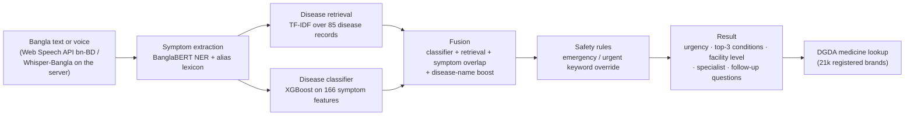

# Architecture

HealthMax has **two implementations of the same triage pipeline**:

| | Where | Used by |
|---|---|---|
| Python service | `backend/` (FastAPI) | `/api/triage`, `/api/triage/voice`, and the WhatsApp webhook |
| Browser engine | `healthmax-ai-assistant/src/lib/browserTriage.ts` (TypeScript) | The web app's `/triage` page, entirely client-side |

The browser engine was added so the hosted demo could run with no Python server. It loads exported model files from `healthmax-ai-assistant/public/model/` (made by `scripts/export_browser_artifacts.py`). The two engines then drifted apart, which is one of the lessons in [POSTMORTEM.md](POSTMORTEM.md).

## Pipeline



### Stages

1. **Input.** The web app uses the browser's speech recognition (`bn-BD`) or typed text. The Python service can transcribe audio with `asif00/whisper-bangla` (`backend/asr.py`).
2. **Symptom extraction** (`backend/ner.py`, `extractSymptoms` in the browser engine). A BanglaBERT model fine-tuned for medical entity tags (symptom, disease, medicine), plus a hand-built alias table (for example, মাথাব্যথা → মাথা ব্যথা) and fuzzy matching.
3. **Retrieval** (`backend/rag.py`). Each of the 85 diseases is a record with its symptoms, urgency, specialist and care level. The extracted symptoms are matched against these records. The planned sentence-embedding + FAISS version fell back to TF-IDF in the shipped artifacts (`models/training_summary.json`).
4. **Classification** (`backend/classifier.py`). XGBoost on a 166-symptom binary vector.
5. **Fusion** (`backend/fusion.py`). Combines classifier probability, retrieval score, symptom overlap, and a boost when the user names a disease directly.
6. **Safety rules** (`backend/rules.py`, `applyTriageRules`). Keyword lists force EMERGENCY or URGENT. Otherwise the top disease's own urgency rating is used.
7. **Follow-up questions** (browser engine). Up to 3 rounds of targeted yes/no and free-text questions that re-weight the candidate diseases.
8. **Output.** Urgency level, the care level to go to (community clinic, upazila health complex, district hospital), a specialist, and the top-3 conditions. The demo build also shows medicine suggestions from the DGDA list and partner doctors, which the post-mortem flags as design mistakes.
9. **Response text** (`backend/generator.py`). Uses GPT-4o if a key is set, then Amazon Bedrock (Claude Haiku), then a Bangla template. The browser engine always uses the template.

## Web app (`healthmax-ai-assistant/`)

- React 18 + Vite + TypeScript, Tailwind and shadcn/ui. Scaffolded with Lovable, then extended by hand.
- Bangla and English UI (`src/lib/i18n.ts`, `LanguageContext`).
- Pages:
  - home and triage chat;
  - medicine search;
  - patient, doctor and admin dashboards;
  - doctor registration (collects a BMDC number);
  - admin dataset import.
- **Supabase:** auth with user roles, Postgres tables (patient profiles, triage sessions, prescriptions, registered doctors, medicines, clinical rules), and Edge Functions:
  - `healthmax-triage` (proxy to the Python backend);
  - `medicine-search`, `medicine-import`, `dataset-import`;
  - `send-sms`, `twilio-voice`, `twilio-whatsapp`.

## Python service (`backend/`)

| Route | Purpose |
|---|---|
| `GET /health` | Liveness check |
| `POST /api/triage` | Text triage, returns structured JSON |
| `POST /api/triage/voice` | Audio → Whisper-Bangla → triage → optional TTS |
| `POST /webhook/whatsapp` | Twilio WhatsApp entry point |
| `GET /` | Legacy static demo (`frontend/index.html`) |

## Repository layout

```text
HealthMax/
├── backend/          FastAPI service (NER, retrieval, classifier, fusion, rules, ASR/TTS, DGDA lookup)
├── healthmax-ai-assistant/   web app (git submodule) + Supabase functions and migrations
├── data/             dataset processing and silver NER dataset builder; processed data
├── training/         NER fine-tuning script
├── notebooks/        BanglaBERT fine-tuning notebook
├── models/           trained artifacts (large binaries are gitignored)
├── assets/           source datasets (medicine list, symptoms) and the dataset paper
├── tests/            vignette benchmark and evaluation scripts
├── scripts/          run helpers and browser-artifact export
├── frontend/         legacy static demo served by the backend at "/"
├── infra/            unused EC2/nginx deployment sketch
├── brand/            brand kit (v1)
└── docs/             these documents; archive/ holds the working plans
```
